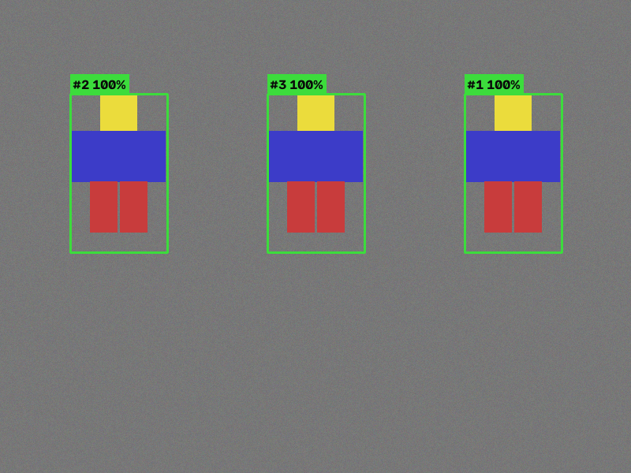

# Roblox Character Detector

An advanced computer-vision tool that finds **Roblox avatars in images and
screenshots** and draws confidence-scored boxes around them. It ships with a
desktop **GUI**, a **command-line** batch tool, and a clean Python API.

**New:** a native **C++ live tool** ([`cpp/`](cpp/README.md)) captures your
screen with DXGI, runs a YOLO model on the **GPU** (TensorRT / CUDA /
DirectML), and draws confidence-scored boxes around characters in real time
on a click-through overlay — 60+ FPS on a midrange GPU. Train a
high-accuracy model for it with the recipe in
[`training/`](training/README.md) (synthetic bootstrap included, no labeling
required to get started).



> **Scope / ethics.** This is an *image analysis* tool. It detects characters
> in still images you give it (screenshots, renders, thumbnails) and visualizes
> the results. It does **not** capture a live game, move your mouse, aim, or
> click — i.e. it is **not** an aimbot. Auto-aiming/auto-firing on other players
> is cheating, violates the [Roblox Terms of Use](https://en.help.roblox.com/hc/en-us/articles/115004647846),
> gets accounts banned, and ruins the game for real people. That functionality
> is intentionally not included and won't be added.

## How it detects characters

Roblox avatars have a very consistent visual signature — large regions of
near-uniform saturated color, blocky parts, a compact head, and humanoid
proportions. The detector fuses several independent strategies and combines
their evidence, so a character found by more than one strategy scores higher:

| Strategy | What it looks for |
|----------|-------------------|
| **Flatness map** | Low local color variance — avatars are flat-shaded, unlike photographic textures. |
| **Head + body assembly** | A compact flat head (classic yellow or skin tones) with a torso-shaped flat region below it, at Roblox proportions. |
| **Flat-color regions** | Blocky, multi-part clusters of saturated flat color at humanoid aspect ratios (catches hatted / occluded heads). |
| **HOG humanoid silhouette** | OpenCV's person detector, re-weighted by how flat-colored the silhouette is (so real people score low, avatars high). |
| **ONNX (optional)** | Plug in any YOLO-style person/character model exported to ONNX for neural detection. |

All hypotheses go through **soft non-maximum-suppression with evidence
fusion**, then a confidence threshold you control.

## Install

```bash
pip install -r requirements.txt
```

The GUI additionally needs Tk (`sudo apt-get install python3-tk` on
Debian/Ubuntu; already present in most Windows/macOS Python installs).

## GUI

```bash
python -m roblox_detector.gui
```

- **Open Image** / **Open Folder** (arrow keys page through a folder)
- **Detection sensitivity** slider re-runs live
- Toggle individual strategies on/off
- **Save Annotated…** and **Export JSON…**

## Command line

```bash
# single image
python -m roblox_detector.cli shot.png

# a whole folder, writing annotated copies + a JSON report
python -m roblox_detector.cli screenshots/ --out annotated/ --json results.json

# tune the threshold, or plug in a neural model
python -m roblox_detector.cli shot.png --threshold 0.5 --onnx yolo_person.onnx
```

## Python API

```python
import cv2
from roblox_detector import RobloxCharacterDetector, DetectorConfig, annotate

detector = RobloxCharacterDetector(DetectorConfig(confidence_threshold=0.4))
image = cv2.imread("shot.png")
detections = detector.detect(image)

for d in detections:
    print(d.label, d.score, d.bbox)   # (x, y, w, h)

cv2.imwrite("annotated.png", annotate(image, detections))
```

Each `Detection` carries an `evidence` dict showing which strategies fired and
how strongly — useful for debugging or tuning on your own footage.

### Using a neural model

Export any YOLO-style person model to ONNX and point the detector at it:

```python
DetectorConfig(onnx_model_path="yolov8n.onnx", onnx_score_threshold=0.3)
```

Neural boxes are fused with the classical strategies through the same NMS
stage, so the two backends reinforce each other.

## Tuning tips

- **Missing characters?** Lower `confidence_threshold` (or the GUI slider).
- **Too many false boxes?** Raise it, or disable the `flat-color regions`
  strategy for busy scenes.
- **Very large screenshots** are auto-downscaled to `max_working_size` for
  speed and mapped back to full resolution.

## Tests

```bash
python -m pytest tests/ -q
```

The suite draws synthetic blocky avatars procedurally, so it needs no image
assets and runs deterministically.

## Project layout

```
roblox_detector/
  detector.py   # detection engine (strategies + fusion)
  gui.py        # tkinter desktop app
  cli.py        # batch command-line tool
tests/
  test_detector.py
cpp/            # native live tool: DXGI capture + GPU ONNX inference
  src/detector/ #   YOLO ONNX detector core (shared by live + CLI)
  src/win/      #   rcd_live: capture, DirectComposition overlay
  src/cli/      #   rcd_cli: batch/benchmark tool (all platforms)
training/       # train + export a Roblox YOLO model (synthetic bootstrap)
```
